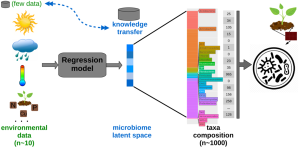

# Deep Latent Microbiome




### Description

**Deep Latent Microbiome** is a novel approach to microbiome representation based on Deep Learning using heterogenous autoencoders to condense the microbiome OTU vector into a latent space.  That encoded microbiomes can be expanded into an accurate reconstruction of the original OTU distribution.

Moreover, through the latent space, microbial species composition can be predicted with relatively high accuracy from the environmental features alone. This makes it possible to predict the structure of a microbiome under hypothetical scenarios, such as future climate states. We also show that transfer learning can be used to predict microbiomes in scenarios where sequencing resources are limited.

Deep Latent Microbiome has been applied to predict Maize rhizosphere microbiome from environmental features.

***

**Citation**: This repository contains software (mainly Jupyter notebooks), data and results files that reproduce the study described in:

**Beatriz García-Jiménez, Jorge Muñoz, Sara Cabello, Joaquín Medina and Mark D. Wilkinson. Predicting microbiomes through a deep latent space (Under review)**
Pre-print available on biorxiv [doi: 10.1101/2020.04.27.063974](https://biorxiv.org/cgi/content/short/2020.04.27.063974v1)

***

### No installation required options

#### Test predictor results
We provide a user-friendly interface, that could be run in the web browser, without requiring neither installation nor computational expertise by the user: https://tinyurl.com/DeepLatentMicrobiome-Maize

There, the user can change the environmental features values (temperature, precipitation and plant age) and to predict their corresponding Maize rhizosphere microbiome in novel ecoystems.

#### Pre-run notebooks with results
If you do not want to run by yourself, all the available notebooks have been pre-run and saved as .html files at [`Notebooks/OutputNotebooks/`](Notebooks/OutputNotebooks/). So, you can easily open them in a web browser and take a look to the different results. 

***

### Installation

#### Virtual environment 
We recommend to create a isolated python virtual environment to install and run the Deep Latent Microbiome software. For further information, have a read in the [virtualenv documentation](https://virtualenv.pypa.io/en/latest/) or [venv documentation](https://docs.python.org/3/library/venv.html)

For example, you can create and activate a virtual environment as following:

```bash
python3 -m venv envDeepLatentMicrobiome
source ./envDeepLatentMicrobiome/bin/activate
```
#### Jupyter
Deep Latent Microbiome software run in python, mainly in Jupyter notebooks. Instructions to install Jupyter software are at [Jupyter install site](https://jupyter.org/install). 

#### Pre-required libraries
It is required to install (with `pip install`), at least, the following python packages:

* jupyther
* tensorflow
* keras
* pandas
* sklearn
* matplotlib
* numpy
* tqdm
* graphviz
* h5py

You can also use `pip install -i requirements.txt` to install all the packages.

#### Pipenv

Alternative to virtual environments you can use the `Pipfile` include in the project with the command `pipenv install`.

#### R
R is not required to run the Deep Latent Microbiome software. R scripts (in [`Src/`](Src/) folder) are used to summarize results and make reproductible the graphs of the manuscript.


***
### Running a Jupyter notebook
Once you have the [Jupyter notebook](https://jupyter.org/install) installed, you move to the directory with your notebooks and start the notebook server from the command line:
```bash
cd Notebooks
jupyter notebook
```
You should see the notebook open in your browser. Then, you click in a notebook to open (such as the representative notebook `MAIN_DeepLatentMicrobiome.ipynb`) and begin to run (or even edit) cells, following the [Jupyter notebook documentation](https://jupyter-notebook.readthedocs.io/en/stable/). 

***
### Main notebook
You can check the main notebook [**`Notebooks/MAIN_DeepLatentMicrobiome.ipynb`**](Notebooks/MAIN_DeepLatentMicrobiome.ipynb) for checking a summary of the main capabilities of the software. Someones are described below.

***
### Train one autoencoder architecture

The best option is to take the notebook [`reference_model_predictions_and_analysis.ipynb`](Notebooks/reference_model_predictions_and_analysis.ipynb) as template and to edit its cells.

To run a particular experiment (one combination from the 405), `perform_experiment_2()` should be called with the corresponding configuration parameters, in a similar way as it is shown in [`Notebooks/OutputNotebooks/reference_model_predictions_and_analysis.html`](Notebooks/OutputNotebooks/reference_model_predictions_and_analysis.html)

```bash
experiment_metrics, models, results = perform_experiment_2(cv_folds = 0, 
                        epochs = 100, 
                        batch_size = 64, 
                        learning_rate = 0.001, 
                        optimizer = optimizers.Adam,
                        learning_rate_scheduler = None,
                        input_transform = Percentage,
                        output_transform = tf.keras.layers.Softmax,
                        reconstruction_loss = MakeLoss(LossBrayCurtis, Percentage, None), 
                        latent_space = 10, 
                        layers = [512,256],
                        activation = 'tanh', 
                        activation_latent = 'tanh', 
                        data_microbioma_train = data_microbioma_train,
                        data_domain_train = data_domain_train,
                        show_results = True, 
                        device='/CPU:0')                        
```

The input datasets are defined in:

* `data_microbioma_train`: OTU dataset
* `data_domain_train`: environmental features dataset

If only the first is defined (i.e. `data_domain_train=None`), a OTU latent space is built. While if both variables are defined (the same as in the example above), a combined latent space is built.

The 405 combinations of hyperparameters tested in this study can be checked in a table [`Results/results_experiments_hyperparameters.csv`](Results/results_experiments_hyperparameters.csv), and programmatically in [`Src/experiments.py`](Src/experiments.py). 
The range of the values of some hyperparameters (the easier to change) were as follows:

* `batch_size`: 64, 128
* `learning_rate`: 0.01, 0.001
* `activation`, `activation_latent`: 'tanh', 'relu', 'sigmoid'
* `input_transform`: Percentage (TSS), CenterLogRatio (CLR), none
* `latent_space`: 10, 50, 100

#### Running multiple autoencoder configurations
The evaluation of multiple configuration of autoencoder hyperparameters consist mainly on repeated calls to the function `perform_experiment_2`, explained above.
In [`Src/experiments.py`](Src/experiments.py) you could find a template for the loops over the different values of the hyperparameters that was tested on the Maize rhizosphere case of study.

***
### To predict microbiome for new environmental features

You can run in the web browser the user-friendly interface https://tinyurl.com/DeepLatentMicrobiome-Maize, if you are using the reference model of this study.

For a different model that you have previously trained (as above), to follow the next steps:

* To write the environmental feature values (in this case, plant age, temperature and precipitation) in a .csv file, for example, `../Datasets/NovelEcosystems/metadata_novel_samples_only3envFeatures.csv`:
```bash
metadata = pd.read_csv('../Datasets/NovelEcosystems/metadata_novel_samples_only3envFeatures.csv', sep='\t')
metadata = metadata.set_index('X.SampleID')
domain = metadata[['age',
                   'Temperature',
                   'Precipitation3Days']]
domain_novel_samples = domain.to_numpy(dtype=np.float32)
```

* Load the model previously trained:
```bash
model, encoder_OTU, encoder_env_features, decoder = models[0]
```

* Compute new predictions:
```bash
predictions_latent = encoder_env_features.predict(domain_novel_samples)
predictions = decoder.predict(predictions_latent)
```


***
### Application to a different dataset

This software was only tested on the Maize Rhizosphere case of study, with data from [Walters et al., 2018](https://doi.org/10.1073/pnas.1800918115).

If you would like to apply to a different datasets, you should mainly code your own `Src/data.py` library to read and pre-process your OTU/ASV table and their associated metadata, defining the way to split for train-test datasets.

Then, you could take the notebook [`Notebooks/reference_model_predictions_and_analysis.ipynb`](Notebooks/reference_model_predictions_and_analysis.ipynb) as template, and modify it according to your newly created functions, calling the read function at the beginning of the notebooks. Similar to the call in the template, for example:
```bash
df_microbioma_train, df_microbioma_test, _, _, \
df_domain_train, df_domain_test, _, _, otu_columns, domain_columns = \
      read_df_with_transfer_learning_subset_fewerDomainFeatures(['age','Temperature','Precipitation3Days'])
```

You could customize your functions depending on the amount and type of your metadata and environmental features.


***
Check the additional documented `Notebooks` for further uses of the software: to use an architecture with a OTU latent space, to aggregate OTU at different taxonomic levels, transfer learning, to train predictor based on a Linear Regression or Multiple Layer Perceptron to compare, etc.

*** 


